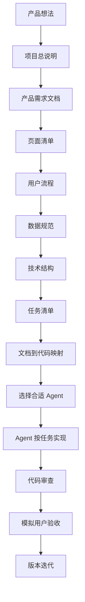
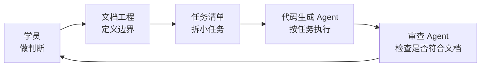

# 第 1 课图文版：核心不是写代码，是用文档控制需求实现

## 1. 本节目标

学完本课，学员要明白：

- 课程核心不是让 AI 一次性写出产品。
- 课程核心是用一整套文档控制需求如何被实现。
- Agent 可以替换，但文档控制体系不能省。
- 学员负责产品判断、边界控制和最终验收。

## 2. 本节产物

```text
文档控制体系总览
```

## 3. 一张图看懂完整流程



## 4. 错误做法 vs 正确做法

| 错误做法 | 正确做法 |
|---|---|
| 直接说“帮我做一个产品” | 先用文档定义第一版边界 |
| 让 Agent 自己决定页面和功能 | 页面和功能必须来自文档 |
| Agent 写完就算完成 | 必须用文档映射和验收标准检查 |
| 需求变化后直接改代码 | 先改文档，再改任务，再实现 |
| 工具越多越好 | 一个任务只交给一个执行 Agent |

## 5. 文档控制分工图



## 6. 操作步骤

### Step 1：先确认课程主轴

请先记住一句话：

```text
不是用 AI 替代文档，
而是用文档控制 AI。
```

### Step 2：理解每类文档的作用

| 文档 | 控制什么 |
|---|---|
| 项目总说明 | 产品边界 |
| 产品需求文档 | 功能范围 |
| 页面清单 | 页面数量和页面职责 |
| 用户流程 | 用户动作和结果闭环 |
| 数据规范 | 字段、类型、存储方式 |
| 技术结构 | 文件职责和实现边界 |
| 任务清单 | Agent 每次改什么 |
| 文档到代码映射 | 代码是否能回溯到文档 |
| 验收清单 | 是否可以通过 |

### Step 3：确认第一版只是承载形态

第一版可以是 H5，也可以后续迁移为微信小程序、iOS App 或 Web App。

但无论形态如何变化，文档控制链路不变。

## 7. 截图位置

```text
[截图占位 1：仓库 README 核心诉求]
[截图占位 2：文档控制体系总览]
[截图占位 3：H5 样例 docs/README.md]
```

## 8. 本节检查清单

- [ ] 我知道课程核心是文档控制需求实现。
- [ ] 我知道 Agent 是执行层，不是决策层。
- [ ] 我知道代码必须能回溯到文档。
- [ ] 我知道需求变更必须先改文档。
- [ ] 我知道不同产品形态可以替换，但文档链路不变。

## 9. 常见错误

### 错误 1：把 Agent 当成产品负责人

Agent 可以执行任务，但不能替你决定产品边界。

### 错误 2：跳过文档直接实现

跳过文档后，代码无法审查，也无法判断是否实现正确。

### 错误 3：需求变更直接改代码

正确做法是先更新 PRD、页面清单、用户流程或数据规范，再更新任务清单。

## 10. 下一步

进入第 2 课：

```text
把产品想法放进文档控制体系。
```
