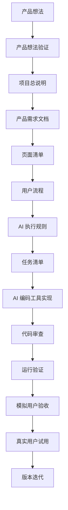
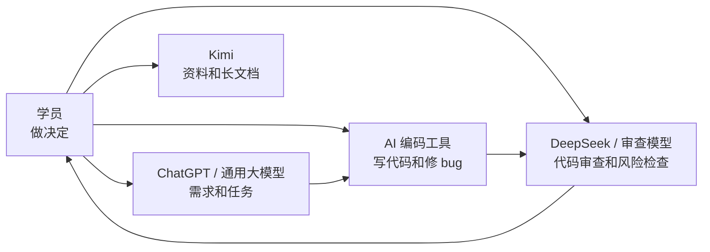

# 第 1 课图文版：AI 开发不是魔法，是工程流程

## 1. 本节目标

学完本课，学员要明白：

- AI 不是一键生成产品的魔法。
- AI 可以写代码，但必须有需求、任务和验收。
- 不同 AI 工具要分工使用。
- 学员自己是产品负责人，不能把决策完全交给 AI。

## 2. 本节产物

```text
AI 工具分工表
```

## 3. 一张图看懂完整流程



## 4. 错误做法 vs 正确做法

| 错误做法 | 正确做法 |
|---|---|
| 直接说“帮我做一个小程序” | 先写清楚第一版做什么 |
| 让 AI 一次写完整项目 | 每次只做一个小任务 |
| AI 写完就算完成 | 必须运行、审查、模拟用户验收 |
| 工具越多越好 | 每个工具有明确分工 |
| 需求随时变 | 先写任务清单，再小步迭代 |

## 5. AI 工具分工图



## 6. 操作步骤

### Step 1：选择你的主力工具

| 工作 | 推荐工具 |
|---|---|
| 梳理需求 | ChatGPT / Kimi / DeepSeek |
| 写代码 | Codex / Cursor / Windsurf / Kimi Coding / Trae / Copilot |
| 审查代码 | DeepSeek / ChatGPT |
| 整理资料 | Kimi |

### Step 2：写下你的分工

```text
我用哪个工具整理需求：
我用哪个工具写代码：
我用哪个工具审查代码：
我自己负责哪些决定：
```

### Step 3：确认课程样例

本课程第一版实战样例：

```text
钓鱼露营地点收藏小程序
```

核心流程：

```text
首页浏览地点 → 进入详情 → 点击收藏 → 收藏页查看
```

## 7. 截图位置

```text
[截图占位 1：仓库 README 首页]
[截图占位 2：AI 工具分工表]
[截图占位 3：课程学习路径]
```

## 8. 本节检查清单

- [ ] 我知道 AI 不是一键生成产品。
- [ ] 我知道自己仍然负责产品判断。
- [ ] 我知道 AI 编码工具只是执行任务。
- [ ] 我知道写代码前要先有文档。
- [ ] 我知道 AI 写完还要审查和验收。

## 9. 常见错误

### 错误 1：把 AI 当成全自动外包团队

AI 可以辅助，但不能替你判断产品方向。

### 错误 2：同时用多个编码工具改同一个功能

这样最容易把工程改乱。第一版只选一个主力编码工具。

### 错误 3：不写任务清单就开始写代码

没有任务清单，AI 不知道边界，容易越写越大。

## 10. 下一步

进入第 2 课：

```text
把想法写成项目总说明和产品需求文档。
```
