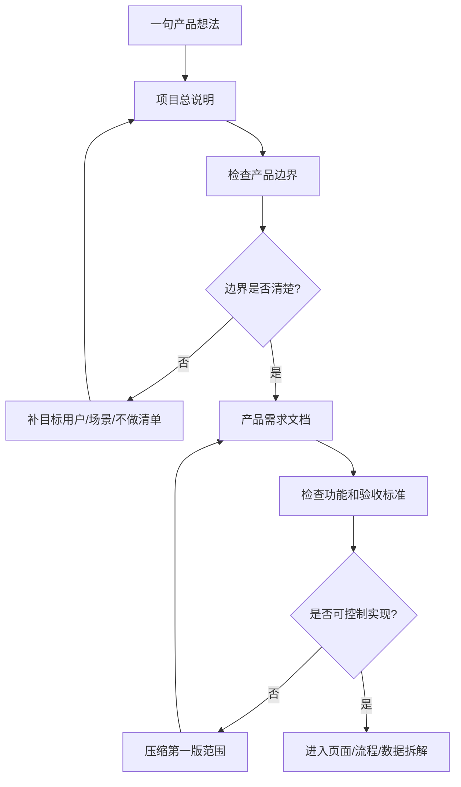

# 第 2 课图文版：把产品想法放进文档控制体系

## 1. 本节目标

把一句模糊的产品想法，整理成可以控制实现的两份核心文档：

- 《项目总说明》
- 《产品需求文档》

这一步不是为了写漂亮文档，而是为了防止后续 Agent 自行理解、自行扩展、自行决定范围。

## 2. 本节产物

```text
01_PROJECT_BRIEF.md
02_PRD.md
```

## 3. 一张图看懂本节流程



## 4. 起始想法

```text
我想做一个工具，帮用户收藏适合钓鱼和露营的地点。
```

这个想法还不能直接交给 Agent 实现。

它缺少：

- 给谁用
- 解决什么问题
- 第一版做什么
- 第一版不做什么
- 做到什么算完成

## 5. Step 1：生成项目总说明

提示词：

```text
请把下面的产品想法整理成《项目总说明》。

要求：
1. 明确目标用户。
2. 明确用户痛点。
3. 明确核心场景。
4. 明确第一版做什么。
5. 明确第一版不做什么。
6. 明确成功标准。
7. 不要扩展到登录、后端、支付、地图、社区等复杂能力。

产品想法：
【粘贴你的想法】
```

## 6. Step 2：项目总说明应该控制什么

| 项目 | 控制作用 |
|---|---|
| 项目名称 | 防止产品定位飘移 |
| 一句话说明 | 防止 Agent 误解产品方向 |
| 目标用户 | 防止做成所有人都用的泛产品 |
| 用户痛点 | 防止功能和真实问题脱节 |
| 第一版做什么 | 定义实现范围 |
| 第一版不做什么 | 防止 Agent 扩功能 |
| 成功标准 | 给后续验收提供依据 |

## 7. Step 3：生成产品需求文档

提示词：

```text
请根据《项目总说明》，生成《产品需求文档》。

要求：
1. 每个功能必须有功能编号。
2. 每个功能必须有优先级。
3. 每个功能必须说明第一版是否做。
4. 每个功能必须有可检查的验收标准。
5. 单独列出第一版不做清单。
6. 不要新增项目总说明之外的能力。

项目总说明：
【粘贴项目总说明】
```

## 8. Step 4：PRD 应该控制什么

| 控制对象 | PRD 里必须有 |
|---|---|
| 功能范围 | 功能清单 |
| 实现优先级 | P0 / P1 / P2 |
| 是否第一版做 | 是 / 否 |
| 验收标准 | 能人工检查的结果 |
| 不做范围 | 明确禁止项 |

## 9. 反面示例

错误需求：

```text
做一个户外地点平台，可以登录、发布地点、地图导航、评论、收藏和推荐。
```

问题：

- 范围太大。
- 功能混在一起。
- 第一版无法控制。
- Agent 会自由发挥。

正确需求：

```text
第一版只做地点浏览、详情查看、收藏和收藏页查看。
不做登录、后端、地图、发布、评论、支付和云同步。
```

## 10. 截图位置

```text
[截图占位 1：输入产品想法]
[截图占位 2：生成项目总说明]
[截图占位 3：生成 PRD 功能清单]
[截图占位 4：第一版不做清单]
```

## 11. 本节检查清单

- [ ] 产品想法已经进入项目总说明。
- [ ] 目标用户具体。
- [ ] 第一版做什么清楚。
- [ ] 第一版不做什么清楚。
- [ ] PRD 功能有编号。
- [ ] 每个功能有验收标准。
- [ ] 没有让 Agent 自行补功能。

## 12. 常见错误

### 错误 1：项目总说明只写愿景

愿景不能控制实现。必须写清第一版边界。

### 错误 2：PRD 没有不做清单

没有不做清单，Agent 很容易把功能越做越大。

### 错误 3：验收标准不可检查

错误：用户体验好。

正确：用户可以完成首页浏览、进入详情、收藏、在收藏页查看。

## 13. 下一步

进入第 3 课：

```text
把 PRD 拆成页面、流程和数据规范。
```
