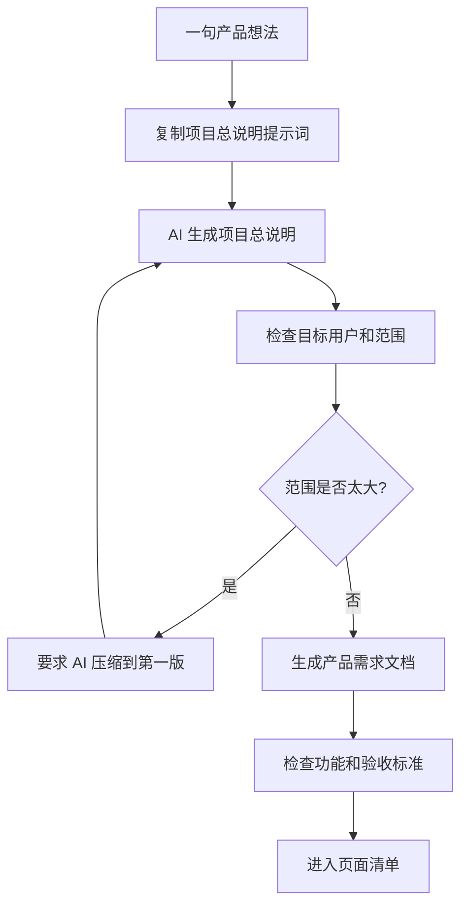

# 第 2 课图文版：从想法到项目总说明和产品需求文档

## 1. 本节目标

把一句模糊的产品想法，整理成：

- 《项目总说明》
- 《产品需求文档》
- 第一版做什么
- 第一版不做什么
- 可验收的成功标准

## 2. 本节产物

```text
examples/01_wechat_mini_program_favorites/docs/00_PROJECT_BRIEF.md
examples/01_wechat_mini_program_favorites/docs/01_PRD.md
```

## 3. 一张图看懂本节流程



## 4. 起始想法

```text
我想做一个小程序，帮大家收藏适合钓鱼和露营的地点。
```

这个想法还不够清楚。

它缺少：

- 给谁用
- 解决什么痛点
- 第一版做什么
- 第一版不做什么
- 做到什么算完成

## 5. Step 1：复制项目总说明提示词

打开：

```text
prompts/chatgpt/01_product_brief_prompt.md
```

把提示词复制给 ChatGPT / Kimi / DeepSeek。

输入：

```text
我的想法是：
我想做一个小程序，帮大家收藏适合钓鱼和露营的地点。
```

## 6. Step 2：AI 应该输出什么

期望输出类似这样：

```markdown
# 项目总说明

## 1. 项目名称

钓鱼露营地点收藏小程序

## 2. 一句话说明

一个帮助上海周边钓鱼、露营用户浏览、查看和收藏地点的微信小程序。

## 3. 目标用户

喜欢周末去上海周边钓鱼、露营、短途户外的人。

## 4. 用户痛点

钓鱼和露营地点信息分散在小红书、微信群、地图评论里，用户很难快速判断哪些地点值得收藏。

## 5. 第一版做什么

- 首页地点列表
- 地点详情
- 本地收藏
- 收藏页
- 设置页
- 关于页

## 6. 第一版不做什么

- 登录
- 后端
- 地图
- 发布
- 评论
- 私信
- 支付
- 云同步

## 7. 成功标准

用户可以打开小程序，浏览地点，进入详情，收藏地点，并在收藏页查看。
```

## 7. Step 3：检查 AI 输出是否合格

| 检查项 | 合格标准 |
|---|---|
| 目标用户 | 不是“所有人”，而是一类具体用户 |
| 第一版范围 | 不超过 5 个页面 |
| 不做清单 | 明确写出登录、后端、支付等不做 |
| 成功标准 | 能被普通人检查 |
| 语言 | 非技术用户能看懂 |

## 8. Step 4：如果 AI 输出太大，怎么追问

如果 AI 生成了地图、登录、社区、发布、推荐算法，要这样追问：

```text
这个范围还是太大，请帮我压缩成第一版可运行样例。
要求：
1. 页面不超过 5 个。
2. 不做登录。
3. 不做后端。
4. 不做地图。
5. 不做社区。
6. 只用模拟数据和本地存储。
7. 重新输出第一版范围和不做清单。
```

## 9. Step 5：生成产品需求文档

打开：

```text
prompts/chatgpt/02_prd_prompt.md
```

把《项目总说明》贴进去，让 AI 生成 PRD。

期望功能清单：

| 功能编号 | 功能名称 | 优先级 | 第一版是否做 | 验收标准 |
|---|---|---:|---|---|
| F001 | 首页地点列表 | P0 | 是 | 能看到地点列表 |
| F002 | 地点详情 | P0 | 是 | 能查看地点说明 |
| F003 | 收藏功能 | P0 | 是 | 能收藏和取消收藏 |
| F004 | 收藏页 | P0 | 是 | 能查看已收藏地点 |
| F005 | 设置页 | P1 | 是 | 能看到基础设置 |
| F006 | 关于页 | P1 | 是 | 能看到课程样例说明 |

## 10. 截图位置

```text
[截图占位 1：输入产品想法]
[截图占位 2：AI 输出项目总说明]
[截图占位 3：AI 输出 PRD 功能清单]
[截图占位 4：不做清单高亮标注]
```

## 11. 本节检查清单

- [ ] 项目名称明确。
- [ ] 目标用户具体。
- [ ] 用户痛点具体。
- [ ] 第一版做什么清楚。
- [ ] 第一版不做什么清楚。
- [ ] 功能数量可控。
- [ ] 验收标准可检查。
- [ ] 可以进入页面清单阶段。

## 12. 常见错误

### 错误 1：目标用户写太泛

错误：

```text
适合所有户外用户。
```

正确：

```text
适合周末去上海周边钓鱼、露营、短途户外的人。
```

### 错误 2：第一版功能太多

第一版不要做地图、登录、社区、支付、推荐算法。

### 错误 3：成功标准不可验收

错误：

```text
用户体验好。
```

正确：

```text
用户可以完成首页浏览、进入详情、收藏地点、在收藏页查看。
```

## 13. 下一步

进入第 3 课：

```text
把产品需求拆成页面清单和用户流程。
```
