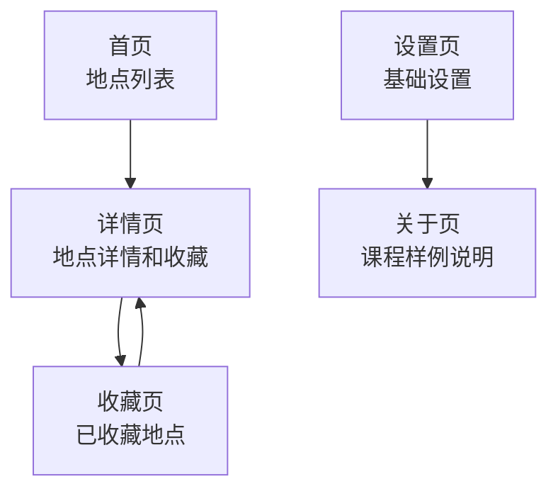
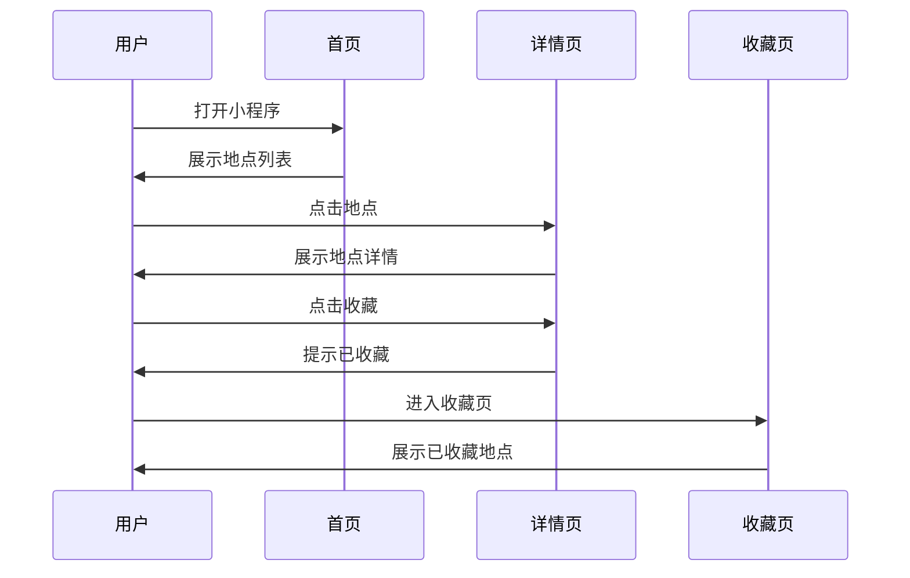

# 第 3 课图文版：页面清单和用户流程

## 1. 本节目标

把产品需求拆成用户能看见、能操作的页面。

本节完成后，你会得到：

- 页面清单
- 页面状态
- 页面跳转关系
- 用户主流程

## 2. 本节产物

```text
examples/01_wechat_mini_program_favorites/docs/02_PAGE_LIST.md
examples/01_wechat_mini_program_favorites/docs/03_UX_FLOW.md
```

## 3. 一张图看懂 5 页面结构



## 4. 小程序页面示意图

```text
┌─────────────────────┐
│ 首页                │
│ ┌─────────────────┐ │
│ │ 地点卡片 1      │ │
│ │ 地区 / 标签 / 摘要 │ │
│ └─────────────────┘ │
│ ┌─────────────────┐ │
│ │ 地点卡片 2      │ │
│ └─────────────────┘ │
└─────────────────────┘
          ↓ 点击地点
┌─────────────────────┐
│ 详情页              │
│ 地点名称            │
│ 地点说明            │
│ 注意事项            │
│ [收藏地点]          │
└─────────────────────┘
          ↓ 收藏后
┌─────────────────────┐
│ 收藏页              │
│ 已收藏地点列表      │
└─────────────────────┘
```

## 5. Step 1：复制页面清单提示词

打开：

```text
prompts/chatgpt/03_page_list_prompt.md
```

输入：

```text
请根据下面 PRD，生成页面清单和用户流程。
【粘贴 PRD】
```

## 6. Step 2：AI 应该输出什么

期望页面清单：

| 页面编号 | 页面名称 | 页面入口 | 页面目标 | 第一版是否做 |
|---|---|---|---|---|
| P001 | 首页 | 小程序启动页 / Tab | 展示地点列表 | 是 |
| P002 | 详情页 | 首页地点卡片 | 展示地点详情和收藏按钮 | 是 |
| P003 | 收藏页 | Tab | 展示已收藏地点 | 是 |
| P004 | 设置页 | Tab | 展示基础设置 | 是 |
| P005 | 关于页 | 设置页 | 展示课程样例说明 | 是 |

## 7. Step 3：每个页面必须有 4 种状态

| 状态 | 含义 | 示例 |
|---|---|---|
| Loading | 加载中 | 正在加载地点 |
| Empty | 无数据 | 暂无收藏 |
| Error | 出错 | 地点数据加载失败 |
| Success | 正常 | 显示地点列表 |

## 8. Step 4：用户流程

核心流程必须闭环：



## 9. 截图位置

```text
[截图占位 1：页面清单表格]
[截图占位 2：用户流程图]
[截图占位 3：首页页面示意]
[截图占位 4：详情页页面示意]
[截图占位 5：收藏页页面示意]
```

## 10. 本节检查清单

- [ ] 页面不超过 5 个。
- [ ] 每个页面有入口。
- [ ] 每个页面有目标。
- [ ] 核心页面有 Loading / Empty / Error / Success。
- [ ] 用户流程能闭环。
- [ ] 没有把登录、地图、支付塞回来。

## 11. 常见错误

### 错误 1：页面越拆越多

第一版只保留核心闭环页面。

### 错误 2：只写页面名，不写页面状态

AI 写代码时会漏掉空状态和错误状态。

### 错误 3：流程不闭环

用户收藏后，如果看不到收藏结果，流程就是断的。

## 12. 下一步

进入第 4 课：

```text
给 AI 编码工具写执行规则。
```
