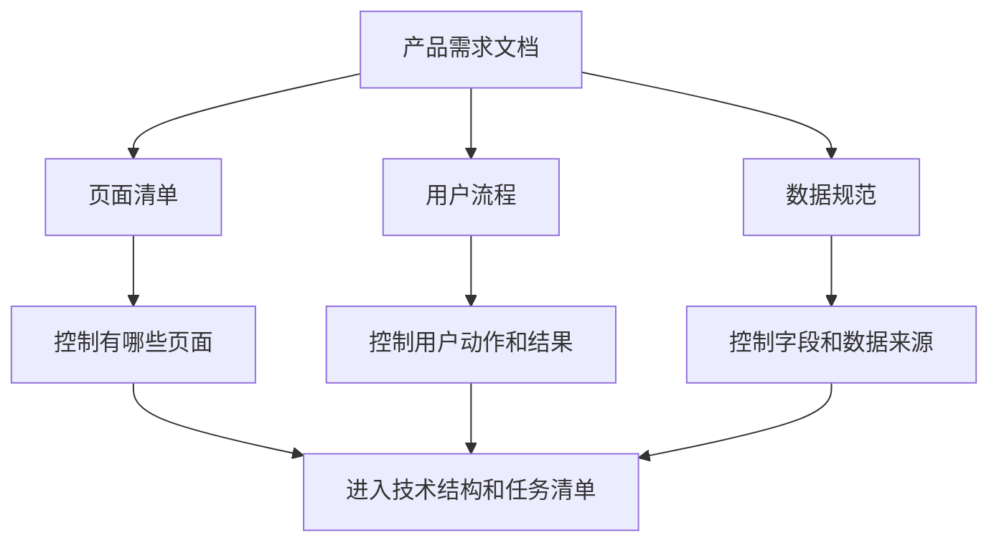

# 第 3 课图文版：用页面、流程和数据继续控制需求

## 1. 本节目标

把 PRD 继续拆成三类控制文档：

- 页面清单
- 用户流程
- 数据规范

这一步的目标是防止 Agent 自行决定页面、自行发明交互、自行创造字段。

## 2. 本节产物

```text
03_PAGE_LIST.md
04_UX_FLOW.md
05_DATA_SPEC.md
```

## 3. 一张图看懂本节流程



## 4. 页面清单控制什么

页面清单不是简单列页面名，而是控制：

- 页面数量
- 页面入口
- 页面目标
- 页面状态
- 页面动作
- 页面对应功能

示例：

| 页面 | 控制内容 |
|---|---|
| 首页 | 用户看到什么列表 |
| 详情页 | 用户如何查看单个对象 |
| 收藏页 | 用户如何看到动作结果 |
| 设置页 | 用户如何管理基础状态 |
| 关于页 | 用户如何理解样例定位 |

## 5. 用户流程控制什么

用户流程必须回答：

```text
用户从哪里开始？
用户点击什么？
系统给什么反馈？
用户在哪里看到结果？
```

错误流程：

```text
首页 → 详情页 → 收藏
```

问题：

```text
用户收藏之后去哪看？
收藏是否成功？
结果在哪里？
```

正确流程：

```text
首页 → 详情页 → 收藏 → 收藏页查看
```

核心规则：

```text
用户做了一个动作，就必须看到对应结果。
```

## 6. 数据规范控制什么

数据规范必须回答：

- 页面需要哪些字段？
- 字段名称是什么？
- 字段类型是什么？
- 字段在哪些页面使用？
- 哪些字段用于逻辑判断？
- 哪些字段用于展示？

示例：

| 字段 | 控制作用 |
|---|---|
| `id` | 控制详情跳转和收藏状态 |
| `name` | 控制页面展示名称 |
| `tags` | 控制标签展示 |
| `description` | 控制详情说明 |
| `tips` | 控制注意事项 |

## 7. Step 1：生成页面清单

提示词：

```text
请根据 PRD 生成页面清单。

要求：
1. 页面数量保持最小闭环。
2. 每个页面必须有入口。
3. 每个页面必须有目标。
4. 每个页面必须有用户动作。
5. 每个核心页面必须有 Empty / Error / Success 状态。
6. 不允许新增 PRD 之外的页面。

PRD：
【粘贴 PRD】
```

## 8. Step 2：生成用户流程

提示词：

```text
请根据 PRD 和页面清单生成用户流程。

要求：
1. 写出核心流程。
2. 每个用户动作后必须有结果。
3. 标出流程是否闭环。
4. 如果流程断了，请指出断点。

PRD：
【粘贴 PRD】

页面清单：
【粘贴页面清单】
```

## 9. Step 3：生成数据规范

提示词：

```text
请根据 PRD、页面清单和用户流程生成数据规范。

要求：
1. 列出每个字段。
2. 说明字段类型。
3. 说明字段是否必填。
4. 说明字段在哪些页面使用。
5. 说明哪些字段用于交互逻辑。
6. 不允许自行发明页面不需要的字段。
```

## 10. 截图位置

```text
[截图占位 1：页面清单表格]
[截图占位 2：用户流程闭环图]
[截图占位 3：错误流程和正确流程对比]
[截图占位 4：数据字段表]
```

## 11. 本节检查清单

- [ ] 页面清单来自 PRD。
- [ ] 页面数量没有失控。
- [ ] 每个页面都有入口和目标。
- [ ] 用户流程闭环。
- [ ] 用户动作后有结果承接。
- [ ] 数据字段来自页面和流程。
- [ ] Agent 不能自行新增页面和字段。

## 12. 常见错误

### 错误 1：只写页面名

页面名不能控制实现，必须写清入口、目标、动作和状态。

### 错误 2：流程没有结果承接

用户做了动作，却看不到结果，说明流程断了。

### 错误 3：数据字段由 Agent 自己发明

字段必须来自页面和流程，不是 Agent 想写什么就写什么。

## 13. 下一步

进入第 4 课：

```text
把页面、流程和数据转成技术结构、任务清单和 Agent 输入。
```
