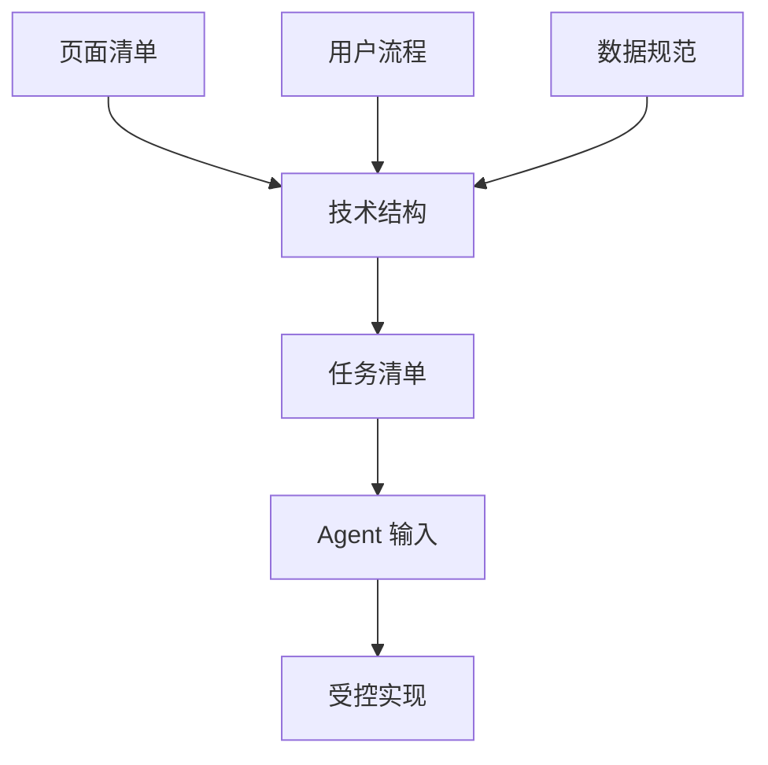

# 第 4 课图文版：把文档转成技术结构和 Agent 任务边界

## 1. 本节目标

把前面得到的文档继续转成：

- 技术结构
- 任务清单
- Agent 实现指南

本节的重点不是让 Agent 立即写代码，而是先规定：

```text
Agent 可以改什么，不能改什么，完成后如何判断。
```

## 2. 本节产物

```text
06_ARCHITECTURE.md
07_TASKS.md
09_AGENT_IMPLEMENTATION_GUIDE.md
```

## 3. 一张图看懂本节作用



## 4. 技术结构控制什么

技术结构必须回答：

- 用什么产品形态承载第一版？
- 为什么先不用复杂框架？
- 文件如何分工？
- 哪些能力第一版禁止接入？
- 后续如何迁移到其他形态？

示例：

| 文件 | 职责 | 来源文档 |
|---|---|---|
| `index.html` | 页面结构 | 页面清单 |
| `styles.css` | 页面样式 | 页面清单 / 界面要求 |
| `app.js` | 交互逻辑 | 用户流程 |
| `mock/places.js` | 模拟数据 | 数据规范 |
| `README.md` | 项目说明和运行方式 | 项目总说明 |

## 5. 任务清单控制什么

任务清单不是普通 TODO，而是 Agent 执行边界。

每个任务必须有：

- 任务编号
- 任务目标
- 依赖文档
- 允许修改文件
- 禁止修改内容
- 验收标准
- 状态

## 6. Agent 实现指南控制什么

Agent 实现指南必须明确：

```text
可以使用不同 Agent，
但任何 Agent 都必须读取文档、遵守任务边界、输出验证方式。
```

Agent 可以替换：

- Codex
- Cursor
- Windsurf
- Kimi Coding
- Trae / MarsCode
- GitHub Copilot
- 其他代码生成 Agent

但流程不能替换：

```text
文档工程 → 任务清单 → Agent 实现 → 文档映射审查 → 用户验收
```

## 7. Step 1：生成技术结构

提示词：

```text
请根据项目总说明、PRD、页面清单、用户流程和数据规范，生成技术结构说明。

要求：
1. 说明第一版采用什么承载形态。
2. 说明为什么不用复杂框架或平台能力。
3. 说明每个文件负责什么。
4. 说明每个文件来自哪份文档。
5. 明确禁止事项。
6. 不要超出第一版范围。
```

## 8. Step 2：生成任务清单

提示词：

```text
请根据所有产品文档生成任务清单。

要求：
1. 一个任务只做一件事。
2. 每个任务必须写依赖文档。
3. 每个任务必须写允许修改文件。
4. 每个任务必须写禁止修改内容。
5. 每个任务必须写验收标准。
6. 任务状态从 TODO 开始。
```

## 9. Step 3：生成 Agent 输入规范

提示词：

```text
请为本项目生成 Agent 实现指南。

要求：
1. 明确可以使用任意合适的代码生成 Agent。
2. 明确文档工程是控制层，Agent 是执行层。
3. 明确 Agent 输入必须包含当前任务、依赖文档、允许修改、禁止修改、验收标准。
4. 明确不允许多个 Agent 同时改同一个任务。
5. 明确 Agent 完成后必须输出修改文件、实现说明、验证方式和风险点。
```

## 10. 截图位置

```text
[截图占位 1：技术结构文件职责表]
[截图占位 2：任务清单表]
[截图占位 3：Agent 输入模板]
[截图占位 4：允许修改 / 禁止修改对比]
```

## 11. 本节检查清单

- [ ] 技术结构来自页面、流程和数据文档。
- [ ] 文件职责清楚。
- [ ] 禁止事项清楚。
- [ ] 任务清单每个任务只做一件事。
- [ ] 每个任务有依赖文档。
- [ ] 每个任务有允许和禁止修改范围。
- [ ] Agent 可以替换，但执行规则不能省。

## 12. 常见错误

### 错误 1：技术结构由 Agent 自己决定

技术结构必须先由文档定义，再交给 Agent 执行。

### 错误 2：任务没有允许修改范围

没有允许修改范围，Agent 容易改乱工程。

### 错误 3：把 Agent 当作唯一方案

Agent 是执行层，可以替换；文档控制体系才是核心。

## 13. 下一步

进入第 5 课：

```text
让 Agent 按文档和任务实现，并要求代码可回溯到文档。
```
