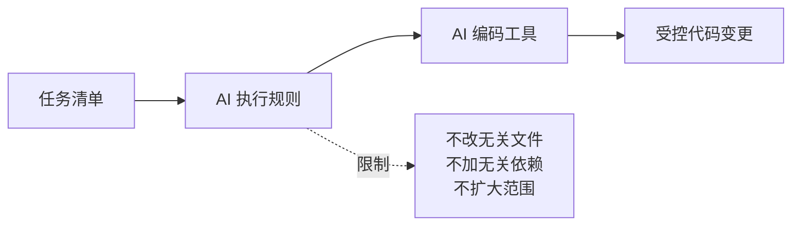

# 第 4 课图文版：给 AI 编码工具写执行规则

## 1. 本节目标

让 AI 编码工具知道：

- 这个项目是什么
- 当前第一版只做什么
- 什么不能做
- 哪些文件可以改
- 完成任务后要汇报什么

## 2. 本节产物

```text
AGENTS.md
examples/01_wechat_mini_program_favorites/AGENTS.md
```

## 3. 一张图看懂 AI 执行规则的作用



## 4. 为什么必须有 AGENTS.md

没有规则时，AI 可能会：

| 风险 | 结果 |
|---|---|
| 随意加依赖 | 学员不会安装，项目跑不起来 |
| 修改无关文件 | 出错后不知道哪里坏了 |
| 大范围重构 | 非技术用户无法维护 |
| 加入登录后端 | 第一版复杂度失控 |
| 写入敏感信息 | 账号和密钥泄露风险 |

## 5. Step 1：打开规则模板

打开：

```text
templates/engineering/AGENTS_TEMPLATE.md
```

复制到项目根目录：

```text
AGENTS.md
```

案例项目也要有自己的规则：

```text
examples/01_wechat_mini_program_favorites/AGENTS.md
```

## 6. Step 2：写入项目规则

第一版样例规则：

```markdown
# 本案例 AI 执行规则

1. 第一版只做微信小程序收藏夹。
2. 不接入后端。
3. 不接入登录。
4. 不接入支付。
5. 不接入地图。
6. 不接入云开发。
7. 不引入第三方依赖。
8. 所有数据优先使用 mock 和本地存储。
9. 每次只完成一个 TASK。
10. 修改后必须说明修改文件、验证方式和风险点。
```

## 7. Step 3：规则检查图

```text
┌──────────────────────────────┐
│ AI 可以做                    │
├──────────────────────────────┤
│ 创建页面                     │
│ 修改页面样式                 │
│ 读取 mock 数据               │
│ 使用本地存储                 │
│ 修复当前任务相关 bug         │
└──────────────────────────────┘

┌──────────────────────────────┐
│ AI 不可以做                  │
├──────────────────────────────┤
│ 接入登录                     │
│ 接入后端                     │
│ 接入支付                     │
│ 引入无关依赖                 │
│ 大范围重构                   │
│ 修改无关文件                 │
└──────────────────────────────┘
```

## 8. 截图位置

```text
[截图占位 1：AGENTS.md 文件位置]
[截图占位 2：禁止事项高亮]
[截图占位 3：每次只做一个任务的规则]
```

## 9. 本节检查清单

- [ ] 有根目录 `AGENTS.md`。
- [ ] 案例项目也有自己的 `AGENTS.md`。
- [ ] 写清楚第一版不做什么。
- [ ] 写清楚不允许引入依赖。
- [ ] 写清楚每次只完成一个任务。
- [ ] 写清楚完成后必须输出修改说明。

## 10. 常见错误

### 错误 1：规则太抽象

错误：

```text
请写高质量代码。
```

正确：

```text
不允许修改无关文件，不允许引入第三方依赖。
```

### 错误 2：没有禁止事项

禁止事项比“应该做什么”更重要。

### 错误 3：规则写完不用

每次给 AI 编码工具任务时，都要提醒它先读 AGENTS.md。

## 11. 下一步

进入第 5 课：

```text
拆任务，并让 AI 编码工具完成首页地点列表。
```
