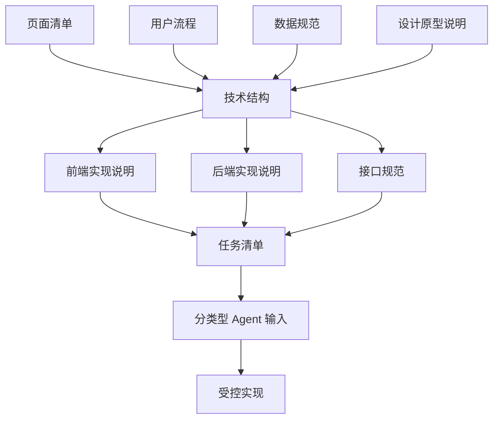

# 第 4 课图文版：把需求设计转成前端、后端和接口技术结构

## 1. 本节目标

把前面得到的需求设计文档继续转成工程执行文档：

- 技术结构
- 前端实现说明
- 后端实现说明
- 接口规范
- 任务清单
- Agent 实现指南

本节的重点不是让 Agent 立即写代码，而是先规定：

```text
前端做什么，后端做什么，接口怎么约束，Agent 可以改什么，不能改什么。
```

## 2. 本节产物

```text
07_ARCHITECTURE.md
08_FRONTEND_ARCHITECTURE.md
09_BACKEND_ARCHITECTURE.md
10_API_SPEC.md
11_TASKS.md
12_AGENT_IMPLEMENTATION_GUIDE.md
```

## 3. 一张图看懂本节作用



## 4. 技术结构控制什么

技术结构必须回答：

- 第一版采用什么承载形态？
- 第一版是否需要后端？
- 第一版是否需要真实接口？
- 前端、后端、接口如何分工？
- 文件和目录如何分工？
- 哪些能力第一版禁止接入？
- 后续如何迁移到其他形态？

## 5. 前端实现说明控制什么

前端实现说明必须控制：

- 页面结构
- 组件拆分
- 交互逻辑
- 状态展示
- 样式实现
- 路由或页面切换
- 表单和输入校验
- 调用接口或读取本地数据

前端不能自行决定：

- 新增页面
- 新增字段
- 新增业务规则
- 自行改变用户流程
- 自行新增后端接口

## 6. 后端实现说明控制什么

后端实现说明必须控制：

- 第一版是否需要后端
- 数据模型
- API 接口
- 业务规则
- 数据存储
- 权限和登录
- 服务部署

如果第一版不做后端，也要写清楚：

```text
第一版不做后端。
使用 Mock 数据或本地存储。
后端能力进入后续版本。
```

后端不能自行决定：

- 新增 PRD 没有定义的业务能力
- 新增前端没有使用的接口
- 自行改变字段含义
- 自行加入复杂权限、支付、消息、推荐等能力

## 7. 接口规范控制什么

接口规范用于控制前端和后端之间的数据边界。

即使第一版不做真实接口，也要说明：

- 第一版使用 Mock 数据还是 localStorage
- Mock 字段如何对应未来 API 字段
- Empty / Error / Success 状态如何表达
- 后续如何从 Mock 迁移到真实接口

接口规范必须回答：

```text
前端需要哪些字段？
后端返回哪些字段？
字段类型是否一致？
接口失败时前端如何展示？
```

## 8. 任务清单控制什么

任务清单不是普通 TODO，而是 Agent 执行边界。

每个任务必须有：

- 任务编号
- 任务类型：DOC / DESIGN / FRONTEND / BACKEND / API / REVIEW
- 任务目标
- 依赖文档
- 允许修改文件
- 禁止修改内容
- 验收标准
- 状态

## 9. Agent 实现指南控制什么

Agent 实现指南必须明确：

```text
可以使用不同 Agent，
但任何 Agent 都必须读取文档、遵守任务边界、输出验证方式。
```

Agent 可以按执行层分工：

- 产品文档 Agent
- 原型设计 Agent
- 前端代码 Agent
- 后端代码 Agent
- 接口联调 Agent
- 审查 Agent

但流程不能替换：

```text
文档工程 → 分层任务清单 → 分层 Agent 实现 → 文档映射审查 → 用户验收
```

## 10. Step 1：生成技术结构

提示词：

```text
请根据项目总说明、PRD、页面清单、用户流程、数据规范和设计原型说明，生成技术结构说明。

要求：
1. 说明第一版采用什么承载形态。
2. 判断第一版是否需要后端。
3. 判断第一版是否需要真实接口。
4. 拆分前端、后端、接口职责。
5. 明确每类工程文件来自哪份文档。
6. 明确禁止事项。
7. 不要超出第一版范围。
```

## 11. Step 2：生成前端实现说明

提示词：

```text
请根据页面清单、用户流程、数据规范和设计原型说明，生成前端实现说明。

要求：
1. 列出页面和组件映射。
2. 列出页面切换和交互逻辑。
3. 列出前端使用的数据字段。
4. 列出 Empty / Error / Success 状态。
5. 列出样式和高保真要求。
6. 明确前端不得自行新增页面、字段、接口和业务规则。
```

## 12. Step 3：生成后端实现说明

提示词：

```text
请根据 PRD、数据规范和技术结构，生成后端实现说明。

要求：
1. 先判断第一版是否需要后端。
2. 如果不需要，说明替代方案。
3. 如果需要，列出数据模型、API、业务规则和存储方式。
4. 明确后端不得新增 PRD 之外的业务能力。
```

## 13. Step 4：生成接口规范

提示词：

```text
请根据前端实现说明、后端实现说明和数据规范，生成接口规范。

要求：
1. 判断第一版是否需要真实 API。
2. 如果不需要，说明 Mock / localStorage 如何替代。
3. 如果需要，列出接口、请求参数、响应字段、错误状态。
4. 标出字段来源数据规范。
5. 不允许新增前端不需要、PRD 不要求的接口。
```

## 14. Step 5：生成分类型任务清单

提示词：

```text
请根据所有产品、设计和工程文档生成任务清单。

要求：
1. 一个任务只做一件事。
2. 每个任务必须有任务类型：DOC / DESIGN / FRONTEND / BACKEND / API / REVIEW。
3. 每个任务必须写依赖文档。
4. 每个任务必须写允许修改文件。
5. 每个任务必须写禁止修改内容。
6. 每个任务必须写验收标准。
7. 任务状态从 TODO 开始。
```

## 15. 截图位置

```text
[截图占位 1：前端/后端/API 分层图]
[截图占位 2：前端实现说明]
[截图占位 3：后端实现说明]
[截图占位 4：接口规范]
[截图占位 5：分类型任务清单]
```

## 16. 本节检查清单

- [ ] 技术结构来自需求、页面、流程、数据和设计原型。
- [ ] 前端职责清楚。
- [ ] 后端是否需要已经判断清楚。
- [ ] 接口或 Mock 边界清楚。
- [ ] 任务清单按类型拆分。
- [ ] 前端任务不能自行新增后端接口。
- [ ] 后端任务不能自行新增 PRD 外能力。
- [ ] Agent 可以替换，但执行规则不能省。

## 17. 常见错误

### 错误 1：技术结构由 Agent 自己决定

技术结构必须先由文档定义，再交给 Agent 执行。

### 错误 2：只写前端，不说明后端是否需要

即使第一版不做后端，也要写清不做后端的原因和替代方案。

### 错误 3：没有接口规范

没有接口规范，前端和后端会各自发明字段。

### 错误 4：任务没有类型

没有任务类型，设计、前端、后端、接口会混在一起，后续无法验收。

## 18. 下一步

进入第 5 课：

```text
让不同类型 Agent 按对应任务执行，并要求结果可回溯到文档。
```
