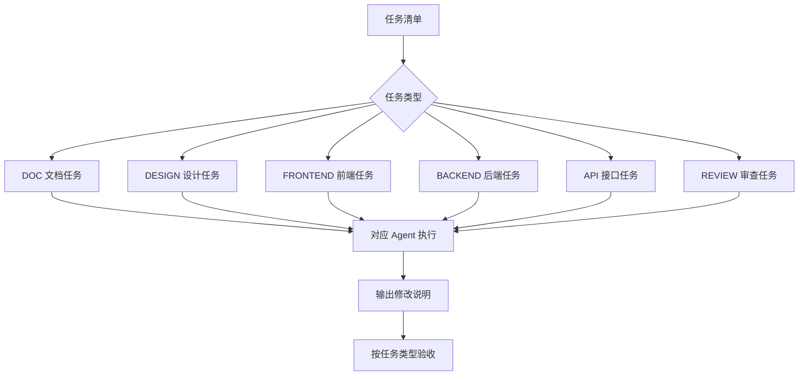

# 第 5 课图文版：让不同类型 Agent 按分层任务执行

## 1. 本节目标

Agent 不是自由写代码，而是按任务类型、依赖文档和执行边界工作。

本节重点是把任务分成不同类型，再交给对应 Agent 执行。

## 2. 本节产物

```text
分类型任务清单
标准 Agent 任务输入
Agent 修改说明
实现验证记录
```

## 3. 任务类型

| 任务类型 | 说明 | 常见产物 |
|---|---|---|
| DOC | 文档任务 | PRD、页面清单、数据规范 |
| DESIGN | 设计 / 原型任务 | 低保真原型、高保真说明、页面状态图 |
| FRONTEND | 前端任务 | 页面、组件、样式、交互、状态展示 |
| BACKEND | 后端任务 | 数据模型、API、业务规则、存储 |
| API | 接口 / 联调任务 | 接口规范、Mock 映射、错误状态 |
| REVIEW | 审查 / 验收任务 | 审查报告、验收报告、修复任务 |

## 4. 一张图看懂分层任务执行



## 5. 标准 Agent 输入结构

每次交给 Agent，都必须包含：

```text
当前任务：TASK-xxx
任务类型：DOC / DESIGN / FRONTEND / BACKEND / API / REVIEW

目标：
【只写当前任务目标】

必须阅读：
【列出相关文档】

允许修改：
【列出允许修改的文件】

禁止修改：
【列出禁止修改的文件和能力】

验收标准：
【列出可检查标准】

完成后输出：
1. 修改文件列表
2. 实现说明
3. 对应文档
4. 验证方式
5. 风险点
```

## 6. 前端任务边界

前端任务主要处理：

- 页面结构
- 组件拆分
- 样式实现
- 交互逻辑
- 状态展示
- 读取 Mock 或调用已定义接口

前端任务不得自行新增页面、字段、业务规则或后端接口。

## 7. 后端任务边界

后端任务主要处理：

- 数据模型
- API 实现
- 业务规则
- 数据存储
- 服务运行

后端任务不得自行新增 PRD 没有定义的业务能力，也不得自行改变字段含义。

## 8. 接口任务边界

接口任务主要处理：

- 接口列表
- 请求参数
- 响应字段
- 错误状态
- Mock 与真实接口映射

接口任务必须以数据规范和前端需要为依据。

## 9. 设计任务边界

设计任务主要处理：

- 页面布局
- 信息层级
- 页面状态
- 按钮位置
- 高保真风格说明

设计任务不得新增 PRD 或页面清单之外的页面范围。

## 10. Agent 输出后必须看什么

| 检查项 | 是否必须 |
|---|---|
| 是否只完成当前任务 | 必须 |
| 是否任务类型正确 | 必须 |
| 是否只修改允许文件 | 必须 |
| 是否没有新增未经允许能力 | 必须 |
| 是否说明对应文档 | 必须 |
| 是否说明验证方式 | 必须 |

## 11. 出错怎么办

不要让 Agent 重新做整个项目。

修复输入必须包含：

```text
当前任务：TASK-xxx
任务类型：FRONTEND / BACKEND / API / DESIGN
报错或问题：
允许修改：
禁止修改：
验收标准：
```

连续修 3 次还不对：

```text
停止继续修复 → 回到任务定义 → 检查文档是否不清楚或任务是否太大
```

## 12. 截图位置

```text
[截图占位 1：分类型任务清单]
[截图占位 2：前端任务输入]
[截图占位 3：后端任务输入]
[截图占位 4：设计任务输入]
[截图占位 5：Agent 输出修改文件和对应文档]
```

## 13. 本节检查清单

- [ ] 当前任务来自任务清单。
- [ ] 当前任务有任务类型。
- [ ] Agent 输入包含依赖文档。
- [ ] Agent 输入包含允许修改范围。
- [ ] Agent 输入包含禁止修改范围。
- [ ] 前端任务没有自行新增后端接口。
- [ ] 后端任务没有自行新增 PRD 外能力。
- [ ] 设计任务没有自行新增页面范围。
- [ ] Agent 输出修改说明和对应文档。

## 14. 下一步

进入第 6 课：

```text
用文档到代码映射和模拟用户验收判断实现是否正确。
```
