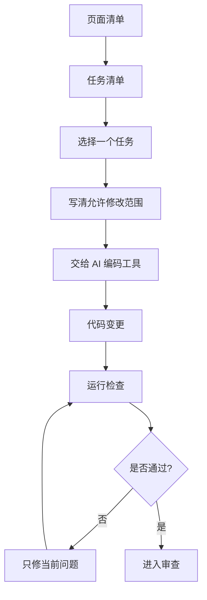

# 第 5 课图文版：让 AI 编码工具按任务写代码

## 1. 本节目标

把“做小程序”拆成 AI 能执行的小任务，并完成第一个核心页面任务。

## 2. 本节产物

```text
examples/01_wechat_mini_program_favorites/docs/05_TASKS.md
首页地点列表
```

## 3. 一张图看懂任务驱动开发



## 4. 任务清单示例

| 任务编号 | 任务名称 | 状态 | 说明 |
|---|---|---|---|
| TASK-001 | 初始化小程序基础结构 | DONE | app 配置和基础页面 |
| TASK-002 | 实现首页地点列表 | DONE | 使用 mock 数据 |
| TASK-003 | 实现详情页 | DONE | 展示详情和收藏按钮 |
| TASK-004 | 实现本地收藏服务 | DONE | 使用 wx 本地存储 |
| TASK-005 | 实现收藏页 | DONE | 展示已收藏地点 |
| TASK-006 | 实现设置页和关于页 | DONE | 基础说明页面 |

## 5. 本节选择任务

```text
TASK-002：实现首页地点列表
```

## 6. Step 1：准备任务提示词

打开：

```text
prompts/codex/CODEX_TASK_PROMPT.md
```

注意：虽然文件名里有 Codex，但提示词适用于：

- Codex
- Cursor
- Windsurf
- Kimi Coding
- Trae
- MarsCode
- GitHub Copilot

## 7. Step 2：任务输入示例

```text
请根据 AGENTS.md 和案例 docs，只完成当前任务。

当前任务：
TASK-002：实现首页地点列表。

目标：
在首页展示 mock 地点数据。

允许修改：
- examples/01_wechat_mini_program_favorites/miniapp/pages/home/
- examples/01_wechat_mini_program_favorites/miniapp/services/placeService.js
- examples/01_wechat_mini_program_favorites/miniapp/mock/places.js

禁止修改：
- app.json
- 其他页面
- 第三方依赖
- 登录、后端、地图、支付相关能力

验收标准：
1. 首页能显示地点列表。
2. 每个地点展示名称、地区、标签、摘要。
3. 点击地点能进入详情页。
4. 空数据时有空状态。
5. 完成后输出修改文件、验证方式和风险点。
```

## 8. Step 3：AI 输出后你要看什么

| 检查项 | 是否合格 |
|---|---|
| 是否只修改允许范围 | 必须 |
| 是否新增无关依赖 | 不能 |
| 是否能显示列表 | 必须 |
| 是否有空状态 | 必须 |
| 是否能跳转详情页 | 必须 |
| 是否输出修改说明 | 必须 |

## 9. 微信开发者工具中应该看到什么

```text
┌──────────────────────────────┐
│ 钓鱼露营地点收藏             │
│ 用 AI 产品工程方法做出的样例 │
├──────────────────────────────┤
│ 长美绿地河岸                 │
│ 上海 · 浦东 · 约18km         │
│ 露营 · 野钓 · 亲水           │
│ 适合周末轻露营和河边休闲     │
├──────────────────────────────┤
│ 郊野河湾草地                 │
│ 上海周边 · 约32km            │
│ 草地 · 停车方便 · 家庭       │
└──────────────────────────────┘
```

## 10. 出错怎么办

如果运行报错，不要让 AI 重写整个项目。

使用修复提示词：

```text
请只修复下面这个报错，不要做无关重构。
请说明根因、修改文件和验证方式。

报错：
【粘贴报错】
```

连续修 3 次还不对：

```text
停止修复 → 回到任务定义 → 检查是否任务太大或允许修改范围不清
```

## 11. 截图位置

```text
[截图占位 1：TASKS.md 任务清单]
[截图占位 2：AI 编码工具输入任务]
[截图占位 3：AI 输出修改文件列表]
[截图占位 4：微信开发者工具首页效果]
[截图占位 5：运行报错时的控制台]
```

## 12. 本节检查清单

- [ ] 任务只做一件事。
- [ ] 允许修改范围清楚。
- [ ] 禁止修改范围清楚。
- [ ] 有验收标准。
- [ ] AI 没有改无关文件。
- [ ] 首页能显示地点列表。
- [ ] 可以进入详情页。
- [ ] 出错时知道怎么让 AI 修。

## 13. 常见错误

### 错误 1：任务太大

错误：

```text
帮我做完整收藏小程序。
```

正确：

```text
只实现首页地点列表。
```

### 错误 2：没有限制修改范围

AI 可能把多个页面一起改了。

### 错误 3：报错后让 AI 重写

应该只修当前报错，不要重写。

## 14. 下一步

进入第 6 课：

```text
代码审查、运行验证和模拟用户验收。
```
