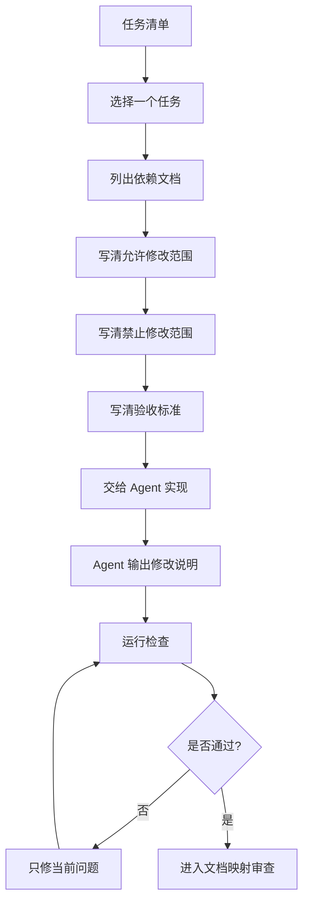

# 第 5 课图文版：让 Agent 按文档和任务实现

## 1. 本节目标

让 Agent 开始实现之前，学员必须先知道：

```text
Agent 不是自由写代码，
而是按文档和任务边界执行。
```

本节重点是学习如何把一个任务交给 Agent，并要求它的产物能回溯到文档。

## 2. 本节产物

```text
标准 Agent 任务输入
Agent 修改说明
实现验证记录
```

## 3. 一张图看懂任务驱动实现



## 4. 标准 Agent 输入结构

每次交给 Agent，都必须包含：

```text
当前任务：TASK-xxx

目标：
【只写当前任务目标】

必须阅读：
【列出相关文档】

允许修改：
【列出允许修改的文件】

禁止修改：
【列出禁止修改的文件和能力】

验收标准：
【列出可检查标准】

完成后输出：
1. 修改文件列表
2. 实现说明
3. 验证方式
4. 风险点
```

## 5. 示例任务

```text
当前任务：TASK-001

目标：
建立第一版基础文件结构。

必须阅读：
- 01_PROJECT_BRIEF.md
- 02_PRD.md
- 03_PAGE_LIST.md
- 04_UX_FLOW.md
- 05_DATA_SPEC.md
- 06_ARCHITECTURE.md
- 07_TASKS.md

允许修改：
- index.html
- styles.css
- app.js
- mock/places.js

禁止修改：
- 不引入框架
- 不接入后端
- 不接入地图
- 不新增登录
- 不做任务外功能

验收标准：
浏览器能打开基础页面，并能看到课程样例说明。

完成后输出：
1. 修改文件列表
2. 实现说明
3. 验证方式
4. 风险点
```

## 6. Agent 输出后必须看什么

| 检查项 | 是否必须 |
|---|---|
| 是否只完成当前任务 | 必须 |
| 是否只修改允许文件 | 必须 |
| 是否没有新增未经允许能力 | 必须 |
| 是否说明修改文件 | 必须 |
| 是否说明验证方式 | 必须 |
| 是否说明风险点 | 必须 |

## 7. 出错怎么办

不要让 Agent 重新做整个项目。

修复输入应该是：

```text
请只修复下面这个问题，不要做无关重构。

当前任务：TASK-xxx

报错或问题：
【粘贴报错】

允许修改：
【只列当前允许修改文件】

禁止修改：
- 不新增功能
- 不改无关文件
- 不引入新依赖

完成后说明：
1. 根因
2. 修改文件
3. 验证方式
```

连续修 3 次还不对：

```text
停止继续修复 → 回到任务定义 → 检查文档是否不清楚或任务是否太大
```

## 8. 截图位置

```text
[截图占位 1：任务清单中的 TASK]
[截图占位 2：Agent 输入]
[截图占位 3：Agent 输出修改文件]
[截图占位 4：运行检查结果]
[截图占位 5：问题修复输入]
```

## 9. 本节检查清单

- [ ] 当前任务来自任务清单。
- [ ] Agent 输入包含依赖文档。
- [ ] Agent 输入包含允许修改范围。
- [ ] Agent 输入包含禁止修改范围。
- [ ] Agent 输入包含验收标准。
- [ ] Agent 输出修改说明。
- [ ] Agent 没有扩大需求范围。
- [ ] 出错时只修当前问题。

## 10. 常见错误

### 错误 1：让 Agent 做完整产品

正确做法是一次只做一个被文档约束的小任务。

### 错误 2：不给依赖文档

不给依赖文档，Agent 就会自己猜需求。

### 错误 3：不给禁止修改范围

没有禁止范围，Agent 很容易顺手加功能、引框架或改无关文件。

## 11. 下一步

进入第 6 课：

```text
用文档到代码映射和模拟用户验收判断实现是否正确。
```
