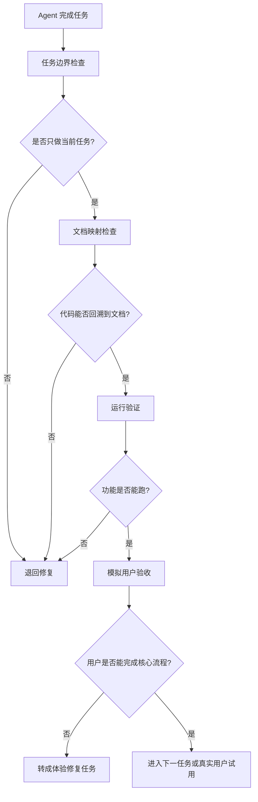

# 第 6 课图文版：用文档映射和用户验收判断实现是否正确

## 1. 本节目标

学会判断 Agent 交付的内容是否真的实现了需求。

本节重点不是继续加功能，而是检查：

- 代码是否能回溯到文档。
- 代码是否符合当前任务。
- 功能是否能运行。
- 用户是否能看懂和完成核心流程。
- 是否可以进入下一轮任务或真实用户试用。

## 2. 本节产物

```text
文档到代码审查记录
运行验证结果
模拟用户验收报告
下一轮修改任务
```

## 3. 一张图看懂三层验收



## 4. 第一层：任务边界检查

先检查 Agent 有没有越界：

| 检查项 | 通过标准 |
|---|---|
| 是否只做当前任务 | 没有顺手做别的功能 |
| 是否只改允许文件 | 没有改无关文件 |
| 是否没有新增依赖 | 没有引入未经批准的框架或库 |
| 是否没有扩大范围 | 没有新增登录、后端、地图、支付等能力 |
| 是否输出修改说明 | 有修改文件、实现说明、验证方式、风险点 |

## 5. 第二层：文档映射检查

用《文档到代码映射》检查：

```text
这段代码是否对应某个任务？
这个页面是否来自页面清单？
这个字段是否来自数据规范？
这个交互是否来自用户流程？
这个功能是否满足 PRD 验收标准？
```

如果代码无法回溯到文档，就不能通过。

## 6. 第三层：运行验证

运行验证只看事实：

| 检查项 | 合格标准 |
|---|---|
| 页面能打开 | 没有白屏 |
| 首页能显示内容 | 能看到列表或明确空状态 |
| 点击有结果 | 能进入目标页面或状态变化 |
| 核心动作有效 | 收藏、清空等动作能生效 |
| 刷新后状态合理 | 本地存储按预期保留或清空 |

## 7. 第四层：模拟用户验收

让 AI 或真实用户模拟目标用户：

```text
请你模拟一个真实用户，检查这个产品是否能完成核心流程。

产品说明：
【项目总说明】

页面清单：
【页面清单】

用户流程：
【用户流程】

当前实现说明：
【Agent 输出】

请检查：
1. 第一次打开是否看得懂？
2. 用户是否知道下一步点哪里？
3. 用户动作后是否有结果？
4. 核心流程是否闭环？
5. 是否有逻辑断点？
6. 是否适合交给真实用户试用？
```

## 8. 问题必须转成任务

发现问题后，不要直接说：

```text
帮我优化一下。
```

要转成明确任务：

```text
TASK-xxx：修复首页样例数据说明不清楚问题

问题来源：
模拟用户验收发现用户不知道当前数据是课程样例数据。

目标：
在首页增加说明文案。

允许修改：
- index.html
- styles.css

禁止修改：
- 不改数据结构
- 不新增功能
- 不接入后端

验收标准：
用户打开首页能看到当前为课程样例数据的说明。
```

## 9. 截图位置

```text
[截图占位 1：Agent 修改说明]
[截图占位 2：文档到代码映射检查]
[截图占位 3：运行验证结果]
[截图占位 4：模拟用户验收报告]
[截图占位 5：问题转任务示例]
```

## 10. 本节检查清单

- [ ] 已做任务边界检查。
- [ ] 已做文档映射检查。
- [ ] 已做运行验证。
- [ ] 已做模拟用户验收。
- [ ] 问题已经转成明确任务。
- [ ] 没有直接让 Agent 自由优化。
- [ ] 可以判断是否进入下一任务。

## 11. 常见错误

### 错误 1：Agent 说完成就算完成

必须用文档、运行结果和用户流程验收。

### 错误 2：只看能不能跑

能跑不代表实现正确。代码还必须符合文档。

### 错误 3：发现问题后直接让 Agent 优化

优化必须任务化，否则需求会再次失控。

## 12. 下一步

进入真实用户试用或下一轮迭代：

```text
真实用户完成核心流程
↓
记录卡点
↓
判断是否属于第一版范围
↓
先改文档
↓
再改任务
↓
再让 Agent 实现
```
