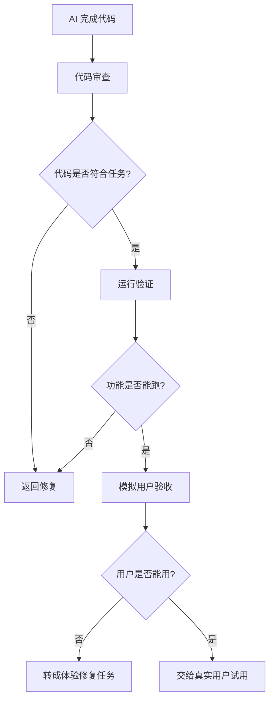

# 第 6 课图文版：代码审查、运行验证和模拟用户验收

## 1. 本节目标

学会判断 AI 写出来的内容是否真的可以交付给人使用。

本节重点不是继续写功能，而是检查：

- 代码是否符合任务
- 功能是否能运行
- 用户是否能看懂和用起来
- 是否可以给真实用户试用

## 2. 本节产物

```text
代码审查报告
模拟用户验收报告
下一轮修改任务
```

## 3. 一张图看懂三层验收



## 4. 第一层：代码审查

打开：

```text
prompts/deepseek/CODE_REVIEW_PROMPT.md
```

输入：

```text
任务说明：
【粘贴 TASK-002】

代码变更说明或 diff：
【粘贴 AI 编码工具输出】

项目规则：
【粘贴 AGENTS.md】
```

期望输出：

```markdown
# 代码审查报告

## 1. 总体结论

通过 / 有条件通过 / 不建议通过

## 2. 必须修改项

## 3. 建议优化项

## 4. 风险点

## 5. 测试建议

## 6. 是否可以进入模拟用户验收
```

## 5. 第二层：运行验证

运行时检查：

| 检查项 | 合格标准 |
|---|---|
| 小程序能打开 | 没有白屏 |
| 首页能显示地点 | 至少有 1 条地点数据 |
| 点击能跳转 | 能进入详情页 |
| 收藏能操作 | 收藏按钮有反馈 |
| 收藏页能显示 | 收藏后能看到数据 |

## 6. 第三层：模拟用户验收

打开：

```text
prompts/chatgpt/06_human_acceptance_prompt.md
```

输入：

```text
产品说明：
【粘贴项目总说明】

页面清单：
【粘贴页面清单】

核心流程：
【粘贴用户流程】

当前交付说明：
【粘贴当前已完成的功能说明】
```

让 AI 模拟用户检查：

```text
第一次打开是否看得懂？
用户是否知道下一步点哪里？
核心流程是否闭环？
文案是否清楚？
是否有逻辑断点？
是否适合给真实用户试用？
```

## 7. 模拟用户验收示例

```markdown
# 模拟用户验收报告

## 1. 总体结论

有条件通过。

## 2. 用户视角体验

用户可以从首页看到地点列表，也能进入详情页并收藏。

## 3. 主要卡点

首页没有说明“这些地点是样例数据”，可能让用户误以为是真实地点库。

## 4. 必须修改项

在首页顶部增加一句说明：当前为课程实战样例数据，后续可接入真实地点。

## 5. 可选优化项

地点卡片可以增加“适合露营 / 适合钓鱼”标签。

## 6. 是否适合真实用户试用

可以给小范围真实用户试用，但需要说明当前是样例数据。
```

## 8. 把问题转成任务

模拟用户验收发现的问题，不能直接让 AI “随便优化”。

要转成任务：

```text
TASK-007：首页增加样例数据说明

目标：
在首页顶部增加说明文案，告诉用户当前为课程实战样例数据。

允许修改：
- pages/home/

禁止修改：
- 其他页面
- 数据服务
- app.json

验收标准：
首页顶部能看到说明文案，且不影响地点列表展示。
```

## 9. 截图位置

```text
[截图占位 1：代码审查提示词输入]
[截图占位 2：代码审查报告]
[截图占位 3：微信开发者工具运行效果]
[截图占位 4：模拟用户验收提示词]
[截图占位 5：模拟用户验收报告]
[截图占位 6：问题转任务示例]
```

## 10. 本节检查清单

- [ ] 代码审查已完成。
- [ ] 运行验证已完成。
- [ ] 模拟用户验收已完成。
- [ ] 主要问题已经转成任务。
- [ ] 没有直接让 AI “随便优化”。
- [ ] 可以判断是否进入真实用户试用。

## 11. 常见错误

### 错误 1：AI 说完成就直接交付

必须运行和验收。

### 错误 2：只看功能，不看用户理解

产品交付给人，用户看不懂就不算完成。

### 错误 3：发现问题后直接让 AI 优化

要先把问题转成明确任务。

## 12. 下一步

进入真实用户试用：

```text
找 3-5 个目标用户，让他们完成：
首页浏览 → 进入详情 → 收藏 → 收藏页查看
```

记录他们卡在哪里，然后进入下一轮迭代。
