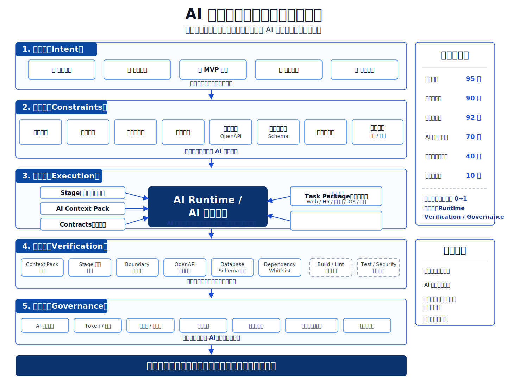
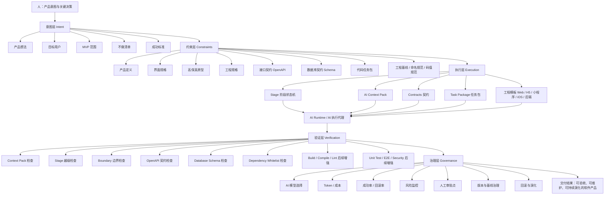
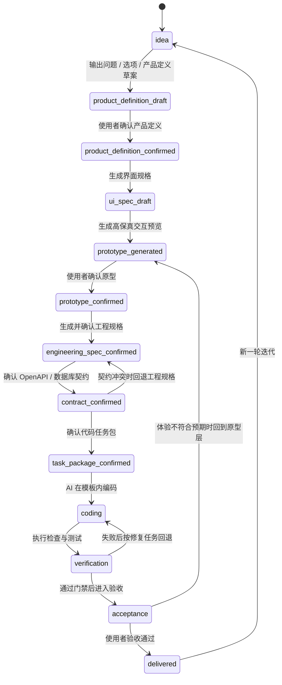
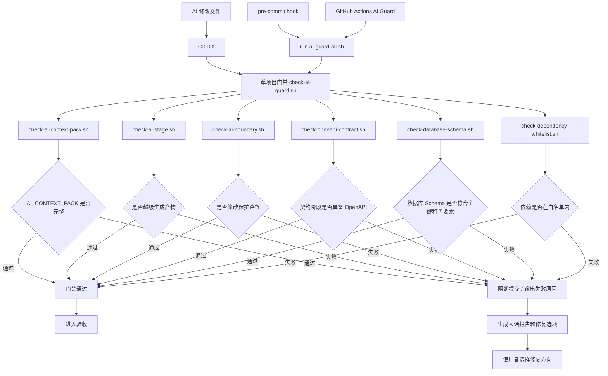
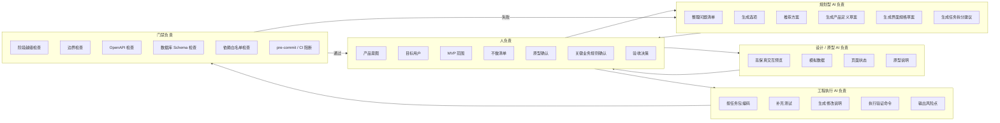

# 四张核心图与 AI 分工

本文不是新的方法论。

本文只是把 `00_系统总览.md` 中已经冻结的结构，转成四张可维护的图。

四张图分别回答四个问题：

```text
1. 整个系统是什么？
2. 产品从想法到交付怎么流动？
3. AI 产出如何被门禁拦住？
4. 哪些工作可以交给 AI，哪些必须人确认？
```

## 0. 图片版总览

下面这张图用于给人快速理解整体结构。后面的 Mermaid 图用于维护和持续修改。



---

## 1. 全局架构图

回答：整个 AI 软件生产控制系统由哪些层组成？



核心判断：

```text
真正的产品不是 AI，而是能持续控制 AI 的生产治理系统。
```

---

## 2. 阶段流程图

回答：产品从想法到交付，必须经过哪些阶段？



阶段规则：

```text
AI 不能从 idea 直接跳到完整案例、工程规格、接口契约、数据库结构或代码。
每个阶段都必须明确：允许输出、禁止输出、进入下一阶段条件、是否需要用户确认。
```

---

## 3. 门禁系统图

回答：AI 的产出如何被脚本和 CI 拦住？



当前门禁能拦：

```text
没有上下文就执行
当前阶段越级生成
修改工程模板
修改工程基线
修改依赖文件
修改配置文件
缺少 OpenAPI
缺少数据库 Schema
数据库 Schema 不符合主键和 7 要素
依赖不在白名单
```

---

## 4. AI 分工图

回答：哪些工作可以交给 AI，哪些必须人确认，哪些必须门禁拦截？



---

## 5. AI 分工表

| 阶段 | 可以主要交给 AI | 必须人确认 | 必须门禁检查 |
|---|---|---|---|
| 想法阶段 | 问题清单、选项、推荐方案、产品定义草案 | 产品目标、目标用户、MVP、不做清单 | 阶段不得越级 |
| 产品定义阶段 | PRD 草案、验收标准草案、边界整理 | 是否值得做、是否进入下一阶段 | 文档完整性 |
| 界面规格阶段 | 页面清单、状态清单、交互说明 | 页面范围、核心流程、字段含义 | 不得生成正式代码 |
| 原型阶段 | 高保真 HTML 原型、模拟数据、状态展示 | 视觉与交互是否符合预期 | 不得写后端和数据库 |
| 工程规格阶段 | 工程规格草案、模块拆分、接口建议 | 采用哪些端、功能边界、风险接受 | 是否引用工程基线 |
| 契约阶段 | OpenAPI、database-schema、依赖白名单草案 | 业务字段、状态、权限、关键规则 | OpenAPI / Schema / 白名单检查 |
| 任务包阶段 | 任务拆分、允许修改范围、验收命令 | 任务顺序、范围是否过大 | 任务包完整性 |
| 编码阶段 | 模板内代码实现、测试补充、修改说明 | 是否接受实现结果 | 阶段、边界、契约、依赖门禁 |
| 验证阶段 | 测试执行、失败分析、人话报告草案 | 选择修复方案、是否验收 | 构建、测试、安全、契约检查 |
| 迭代阶段 | 变更影响分析、回归风险提示 | 是否继续迭代、是否回滚 | 回归门禁和变更记录 |

---

## 6. 分工原则

```text
人做意图判断。
AI 做结构化生成和受控执行。
门禁做强制阻断。
反馈层把技术失败翻译成人话选项。
```

不能交给 AI 独立决定的事情：

```text
产品是否值得做
核心用户是谁
MVP 是否收敛
关键业务规则如何取舍
安全风险是否接受
是否上线
是否回滚
```

适合交给 AI 的事情：

```text
把人话整理成结构化问题
把选项写清楚
把确认后的内容变成契约和任务包
在模板内按任务包编码
执行检查命令
把失败原因翻译成可选择的修复方案
```

必须由门禁拦截的事情：

```text
越级生成
越界修改
缺少契约
修改保护文件
新增白名单外依赖
数据库结构不符合基线
接口不符合 OpenAPI
```
