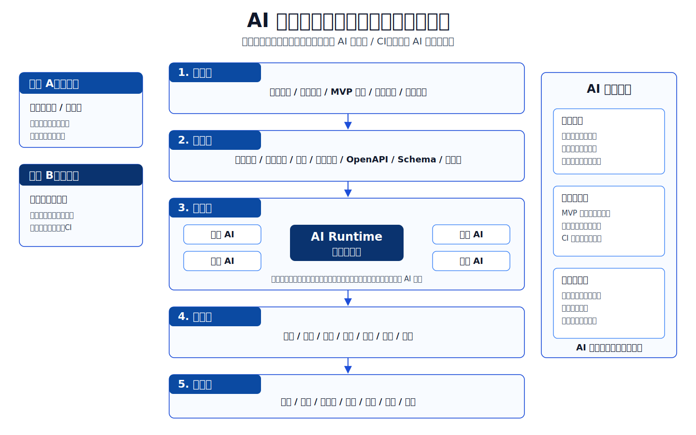
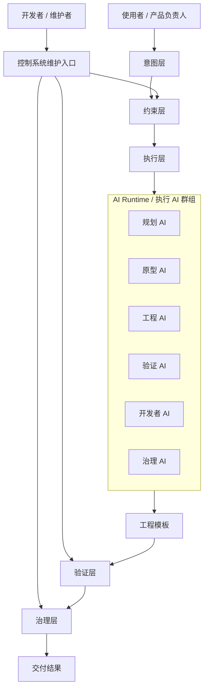
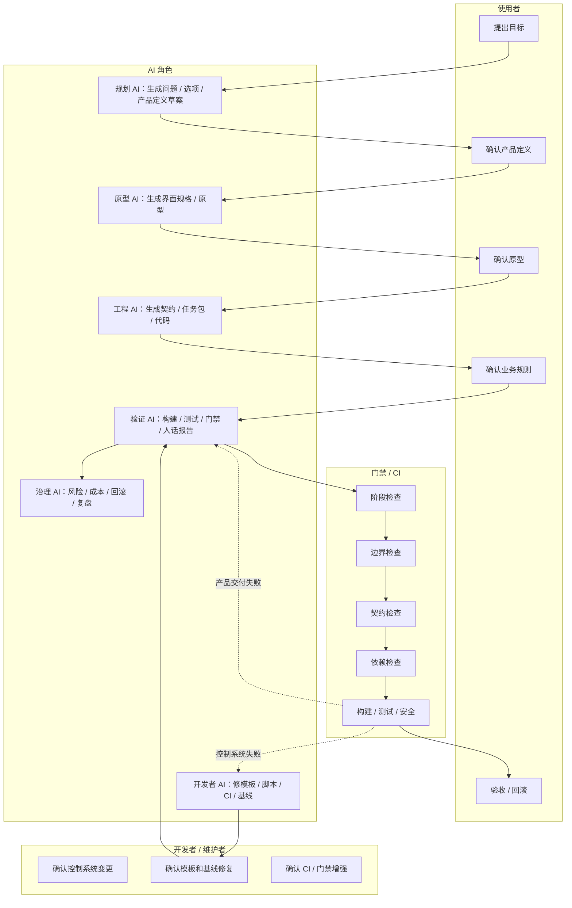
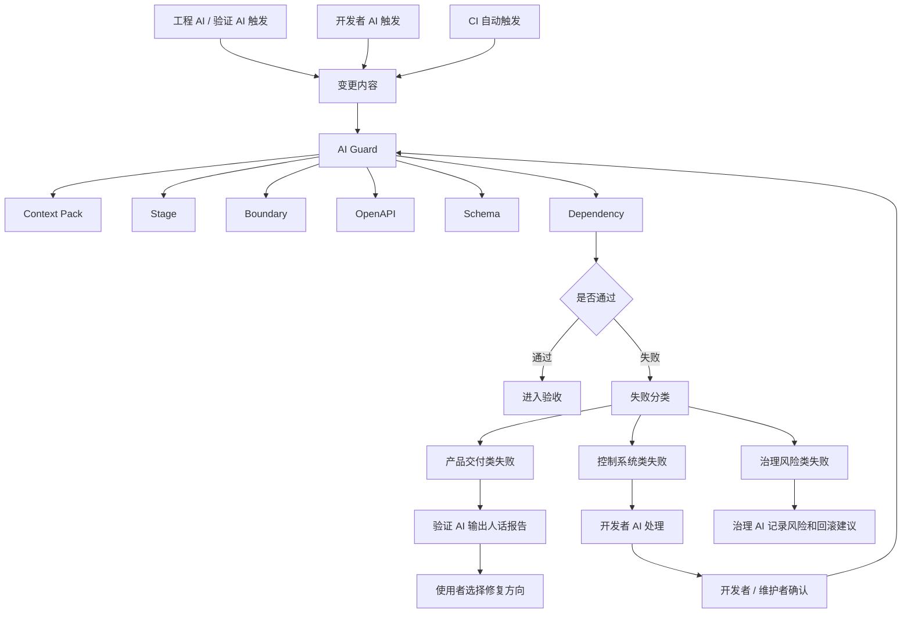
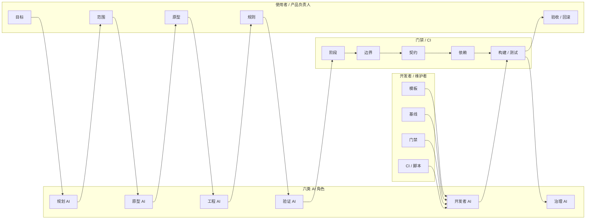

# 角色版执行与 AI 可替代性

本文是在既有控制系统结构冻结的前提下，对“四张核心图”做角色升级。

目标只有一个：把系统从“结构图”升级成“角色执行图”，明确：

- 使用者做什么
- 开发者 / 维护者做什么
- 六类 AI 角色分别做什么
- 门禁 / CI 做什么
- 哪些工作 AI 可直接替代，哪些必须人决策

---

## 1. 图片版总览



---

## 2. 全局架构图（角色版）



要点：

```text
双入口：使用者入口、开发者 / 维护者入口
执行层统一为六类 AI 角色：规划、原型、工程、验证、开发者、治理
同一套控制系统，同时支持产品交付路径和控制系统维护路径
```

---

## 3. 阶段流程图（泳道版）



要点：

```text
使用者负责目标、范围、原型、规则、验收和回滚决策。
规划 / 原型 / 工程 / 验证 AI 负责产品交付路径。
开发者 AI 负责控制系统、模板、脚本、CI、门禁和基线维护。
治理 AI 负责记录风险、成本、回滚建议和演化记录。
门禁 / CI 负责强制阻断。
```

---

## 4. 门禁系统图（触发与归属版）



要点：

```text
失败后先分流：产品失败、控制系统失败、治理风险失败。
产品失败交给验证 AI 翻译。
控制系统失败交给开发者 AI 处理。
治理风险交给治理 AI 记录和沉淀。
```

---

## 5. AI 分工图（角色执行版）



---

## 6. 角色与可替代性矩阵

| 工作项 | 主责任角色 | AI 可替代性 | 是否必须人确认 | 说明 |
|---|---|---|---|---|
| 读取文档与上下文 | 验证 AI / 工程 AI | 高 | 否 | 不应让使用者自己消化全部上下文 |
| 生成产品定义草案 | 规划 AI | 高 | 是 | 使用者确认目标、用户、MVP |
| 生成高保真原型 | 原型 AI | 高 | 是 | 使用者确认视觉与交互 |
| 生成接口与数据契约草案 | 工程 AI | 高 | 是 | 人确认业务语义，不确认技术细节 |
| 拆代码任务包 | 工程 AI | 中高 | 是 | 人只确认顺序和范围 |
| 复制模板并编码 | 工程 AI | 高 | 否 | 结果要经过门禁和验收 |
| 执行构建 / 测试 / 门禁 | 验证 AI / CI | 高 | 否 | 执行后必须输出人话报告 |
| 失败分析与修复建议 | 验证 AI | 高 | 是 | 使用者只在选项之间做选择 |
| 模板普通编译修复 | 开发者 AI | 中高 | 开发者确认 | 属于控制系统维护路径 |
| 增强门禁脚本 / CI | 开发者 AI | 中高 | 开发者确认 | 可由 AI 起草，开发者审定 |
| 调整工程基线或技术栈 | 开发者 / 维护者 | 低 | 是 | 不应交给 AI 自主决定 |
| 风险、成本、回滚建议 | 治理 AI | 中高 | 是 | AI 给建议，人做责任决策 |
| 是否上线 / 是否回滚 | 使用者 / 产品负责人 | 低 | 必须 | AI 只能给建议，不能代替责任 |

核心原则：

```text
AI 可以替代执行，不可以替代责任。
```

---

## 7. 两种模式的边界

### 使用者模式

```text
不碰命令行。
面对的是执行 AI。
只做目标确认、原型确认、业务规则确认、验收 / 回滚决策。
输出要求简单、清晰、高体验、少选择、少技术细节。
```

### 开发者 / 维护者模式

```text
可以碰命令行。
面对的是控制系统本身。
负责模板、门禁、CI、脚本、基线、契约校验的演进和修复。
输出要求稳定、可维护、可验证、可追踪、可回滚。
```

最关键的边界：

```text
使用者不碰命令行。
开发者可以碰命令行。
执行 AI 应尽量替使用者执行命令。
门禁负责把不能通过的结果拦住。
```
